# Module 1 - Introduction to Verilog RTL Design and Synthesis

## Subtopic 1: Introduction to Open-Source Simulator (Iverilog)

---

## Objective

To understand the basics of Verilog design, simulation, and testbench.

---

## Theory

### 🔹 Simulator

* RTL design is verified by simulating the design.
* Simulator checks whether the design meets the required specifications.
* Iverilog is the simulator used in this course.

### 🔹 Design

* Design refers to the actual Verilog code.
* It implements the required functionality of the system.

### 🔹 Testbench

* Testbench is used to apply input stimulus (test vectors) to the design.
* It helps verify the correctness of the design.

### 🔹 How Simulator Works

* Simulator monitors changes in input signals.
* When input changes, output is evaluated.
* If there is no change in input, output remains unchanged.
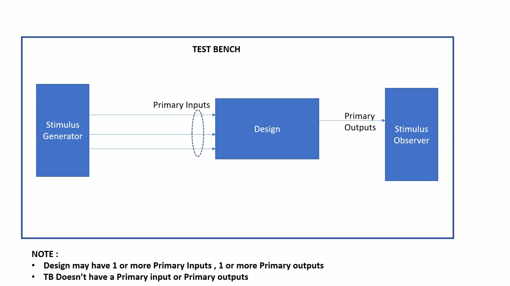

---

## Simulation Flow

* Design and Testbench are given as input to the simulator.
* Simulator generates output in the form of waveform (VCD file).
* Output is visualized using waveform viewer (GTKWave).
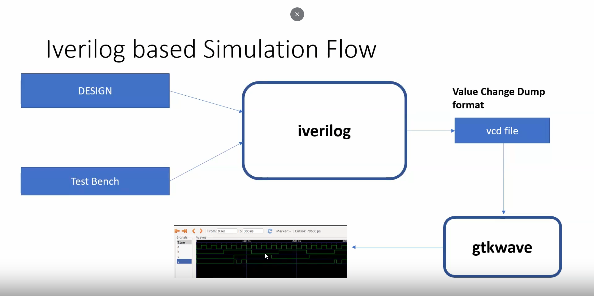

---

## Conclusion

Understood the basic concepts of simulator, design, and testbench along with the working of Iverilog simulation flow.

---


---

## Subtopic 2: Labs using iverilog and gtkwave

---

We have to add a github repository which will contain all the files and tools we will be needing.
We used this command to add the repository:
```bash
git clone https://github.com/vsdip/vsd-rtl.git
```
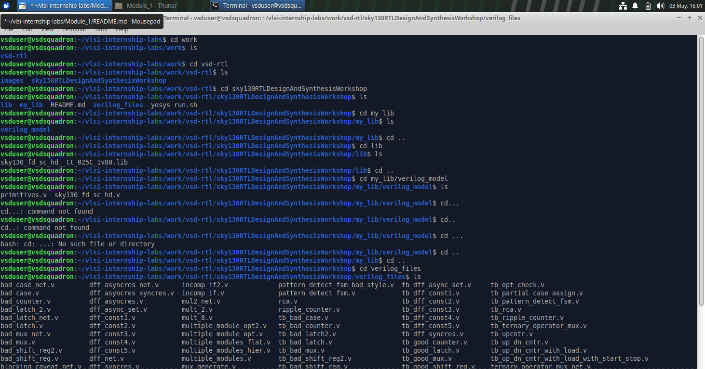

Now in this repo we can see the sky130RTLDesignAndSynthesisWorkshop directory, which will have lib directory containing sky130 standard cell library and also the my_lib directory containg the verilog models and finally the verilog_files directory containing all the verilog files which we will be using during our labs.

---

Now we will work in verilog_files directory. In this directory we can see verilog designs and their corresponding TestBench files(startng with tb_).
command to launch a MUX file using iverilog:
```bash
iverilog good_mux.v tb_good_mux.v
./a.out
gtkave tb_good_mux.vcd
```

NOTE: if any tool is not installed, intall it using
```bash
sudo apt install _____
```
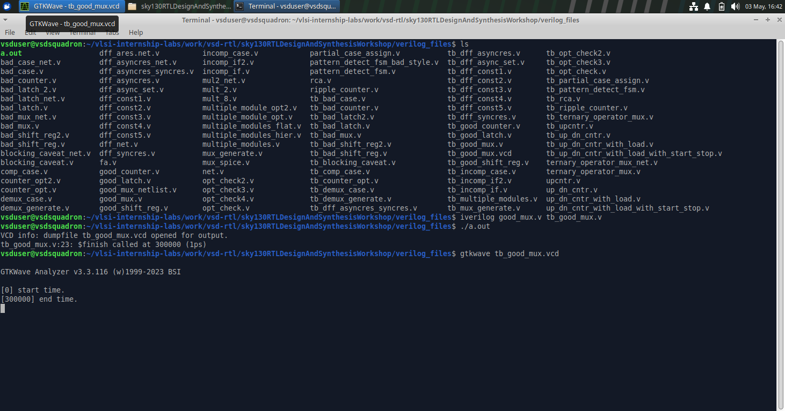

Now the GTKWave window will open. Just drag and drop the inputs and Zoom fit to see the output waveform for the MUX.
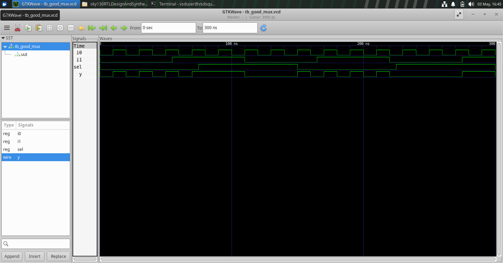

---

Now we will look at the file structure of the verilog files. run the command:
```bash
gvim good_mux.v -o tb_good_mux.v
```
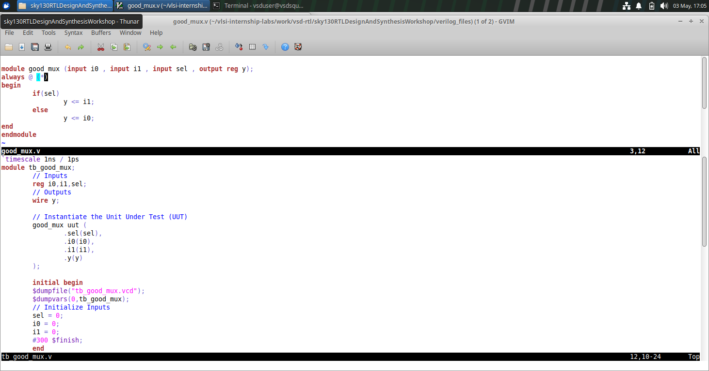
Here we can see the differences between Design and TestBench files and also change the simulation time in the TestBench file.
Hence this file serves as the Simualtion generator.

---

---

## Subtopic 3: Introduction to Yosys and Logic Synthesis

---

## Objective

To understand the concept of logic synthesis, the role of Yosys, and how RTL code is converted into a gate-level netlist.

---

## Theory

### 🔹 Synthesizer

A synthesizer is a tool used to convert RTL design into a netlist.
Yosys is the synthesizer used in this course.

### 🔹 Yosys Setup

The design (RTL code) and the library (.lib file) are given as input to Yosys.
Yosys processes these inputs and generates a netlist file.
A netlist is the representation of the design in terms of standard cells.
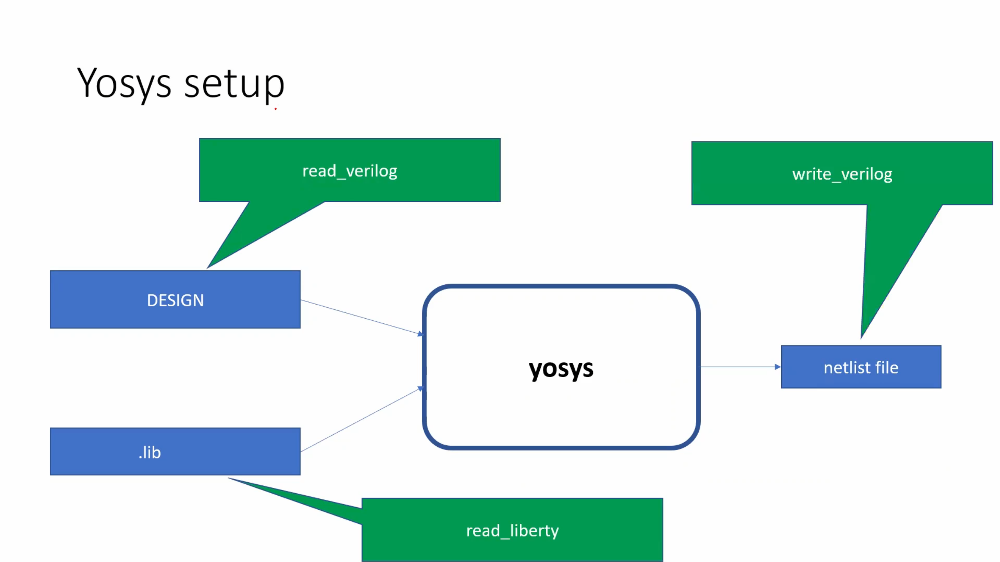

### 🔹 RTL Design

RTL design is a behavioral representation of the required specification.
It is written using Verilog HDL and describes how the system behaves.

### 🔹 Synthesis

Synthesis is the process of converting RTL code into gate-level representation.
The design is mapped into logic gates and their interconnections.
The final output of synthesis is a file called a netlist.
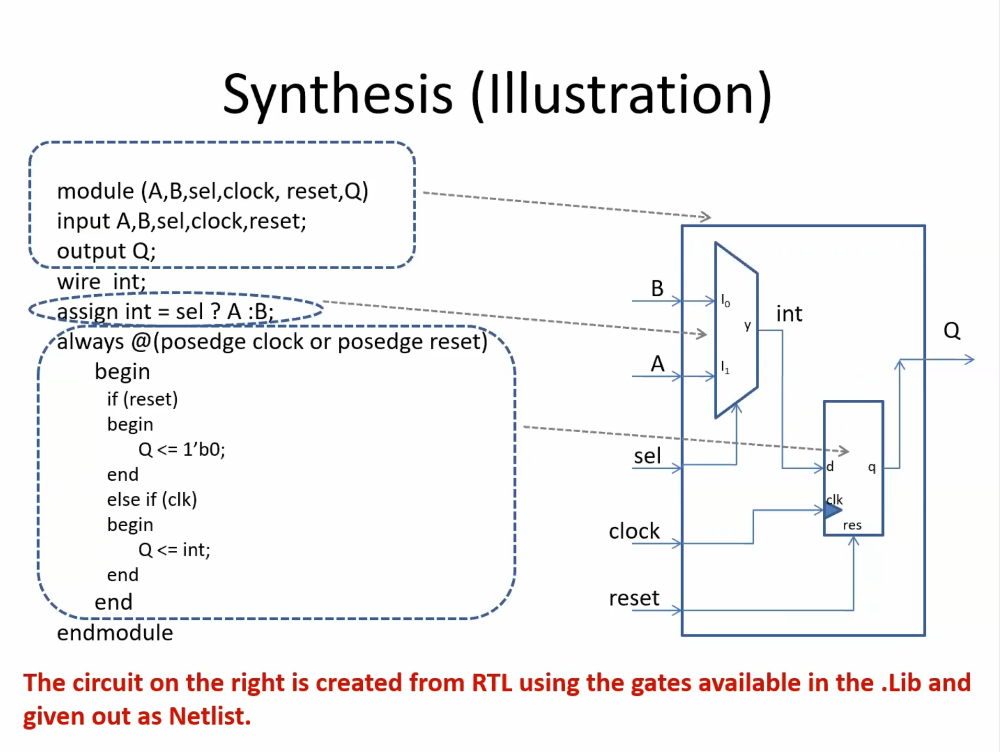

### 🔹 What is .lib

.lib file is a collection of standard cells (logic gates).
It includes different types of gates like AND, OR, NOT, etc.
Each gate can have multiple variants such as slow, medium, and fast.

### 🔹 Why Different Flavours of Gates

The delay in logic circuits determines the maximum speed of operation.
Faster cells reduce delay but consume more area and power.

### 🔹 Why We Need Slow Cells

Slow cells are required to avoid hold time violations.
A balance of fast and slow cells is necessary for proper circuit operation.

### 🔹 Faster vs Slower Cells

Faster cells → lower delay, higher area and power
Slower cells → higher delay, lower area and power
Hence, there is a trade-off between performance, area, and power.

### 🔹 Selection of Cells

The synthesizer selects appropriate cells based on constraints.
Using more fast cells increases performance but may cause power and area issues.
Using more slow cells may reduce performance.
Constraints guide the synthesizer to choose the optimal combination.

---

## Conclusion

Understood the process of logic synthesis, the role of Yosys, and how RTL designs are converted into gate-level netlists using standard cell libraries.

---

---

## Subtopic 4: Labs using Yosys and Sky130 PDKs

---

Firstly we will invoke Yosys. Give the command:
```bash
yosys
```
Now we will read the library in yosys:
```bash
read_liberty -lib ../lib/sky130_fd_sc_hd__tt_025C_1v80.lib
```
Now read the design:
```bash
read_verilog good_mux.v
```
Then selet the module to synthesise:
```bash
synth -top good_mux
```
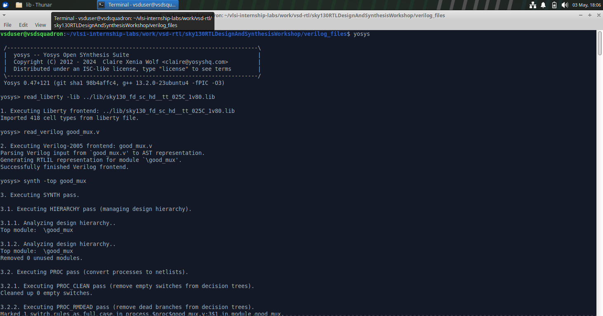

Now since we read the library and design files, we will now generate the netlist.
```bash
abc -liberty ../lib/sky130_fd_sc_hd__tt_025C_1v80.lib
```
Finally re-check the report is correct by cheching the input, output and internal signals.
To see the graphical version of logic representation, the command is:
```bash
show
```
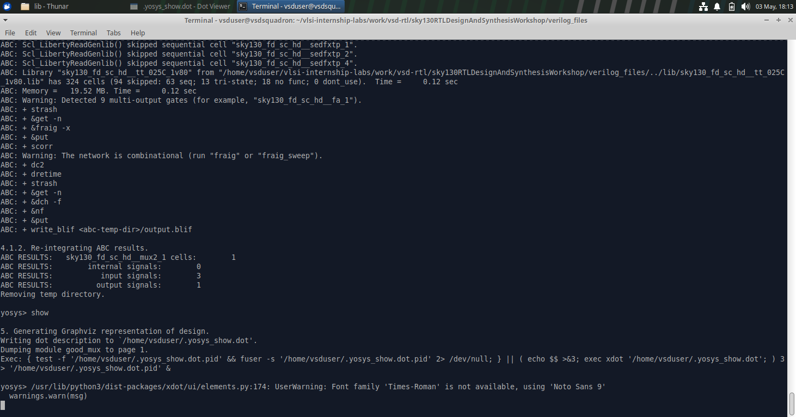
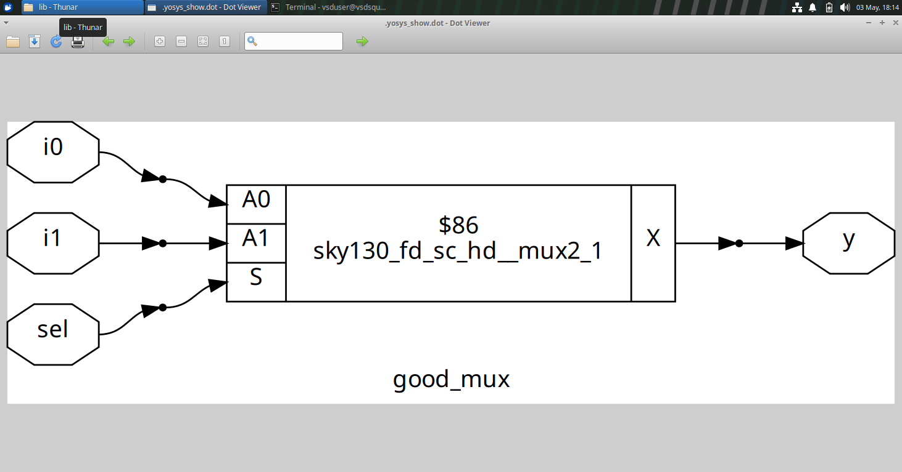

---

Now let us see how to write the netlist. The command to write and then view it is:
```bash
write_verilog good_mux_netlist.v
!gvim good_mux_netlist.v
```
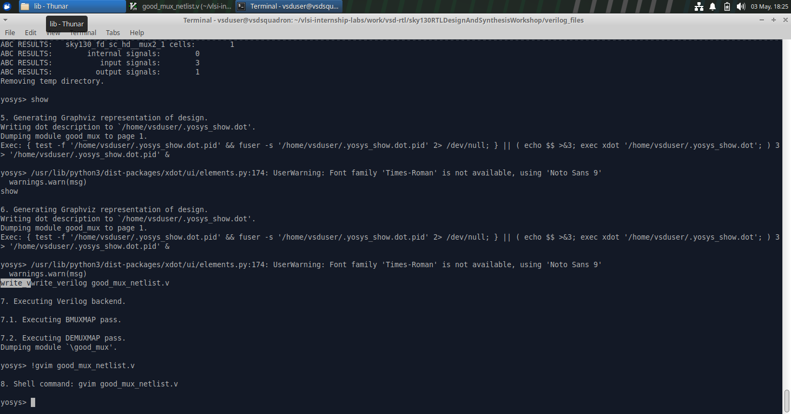
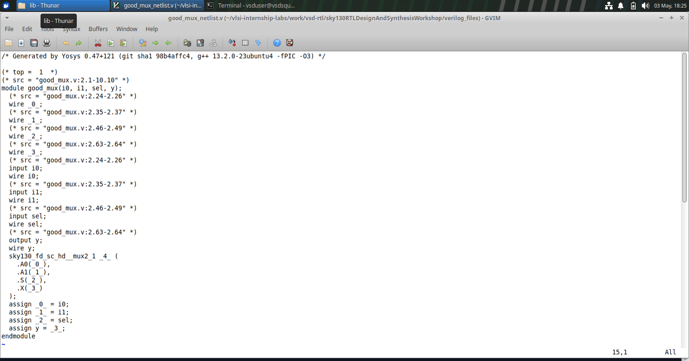

Now to view the netlist in a much simplier version:
```bash
write_verilog -noattr good_mux_netlist.v
!gvim good_mux_netlist.v
```
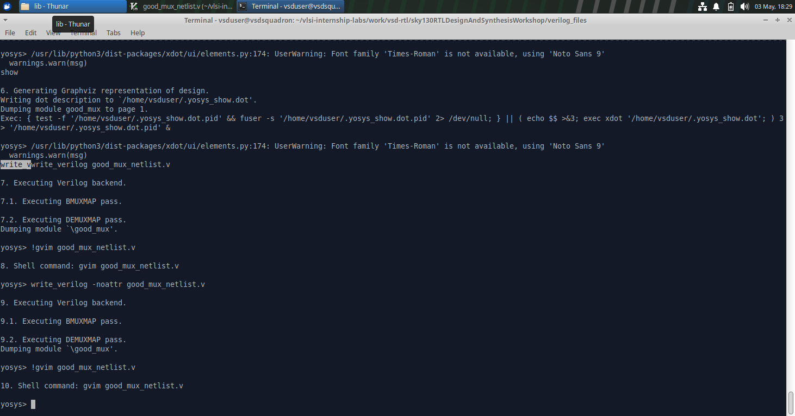
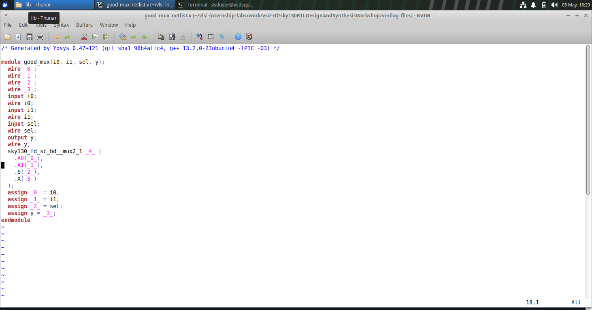

---
