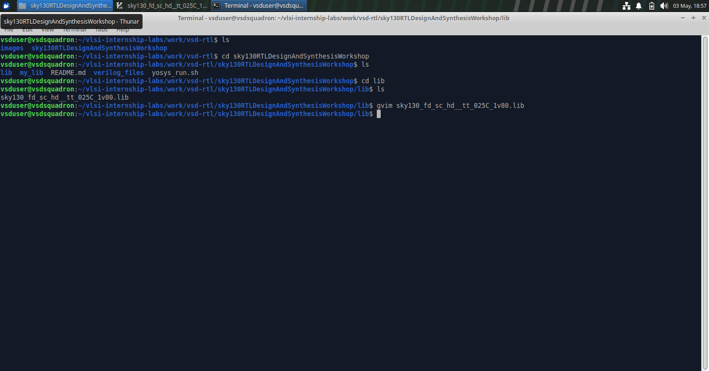
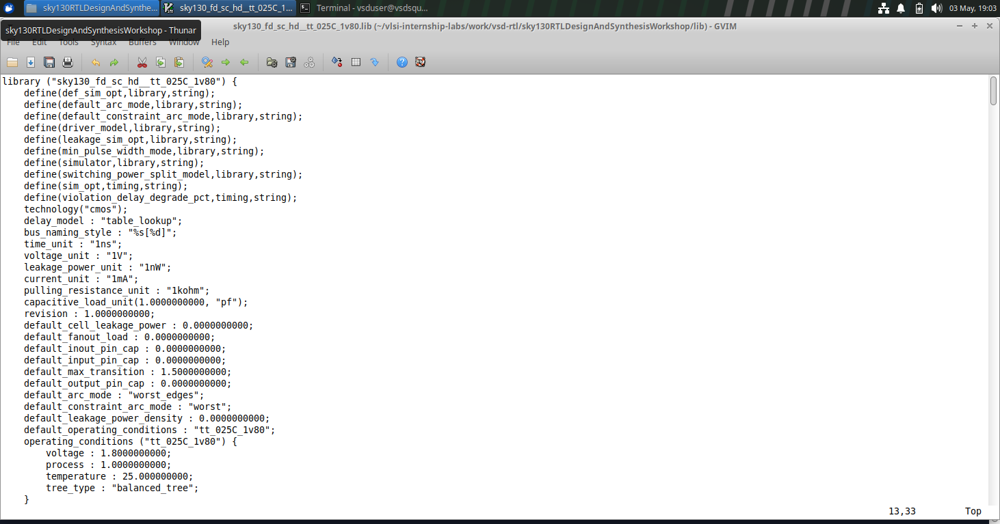
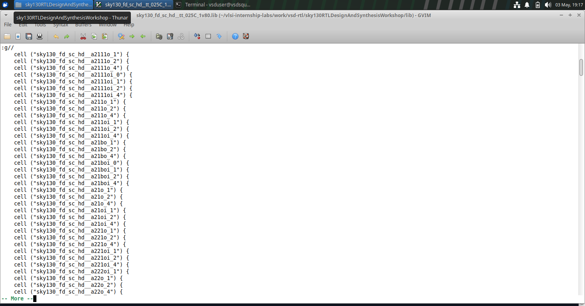
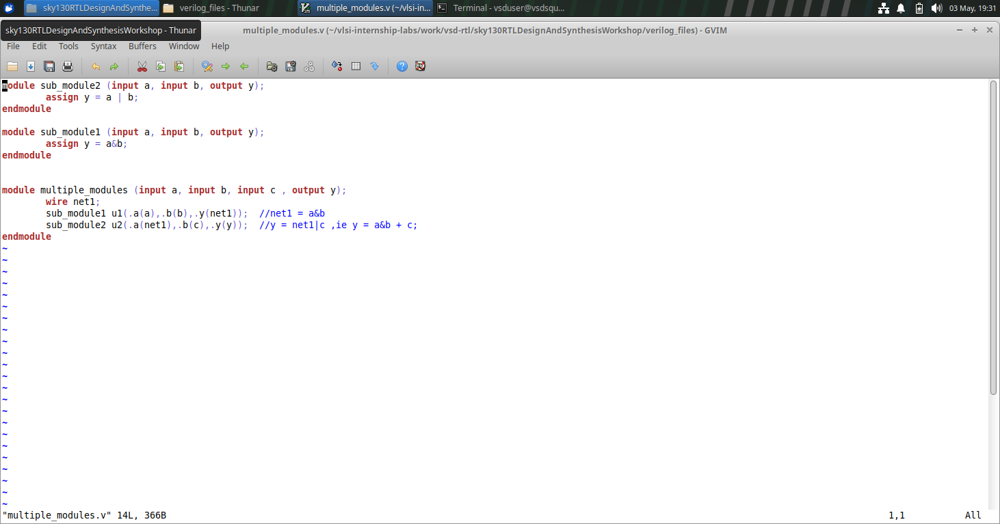
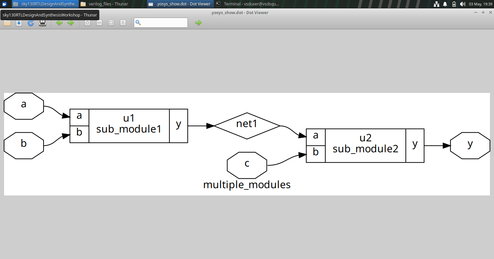
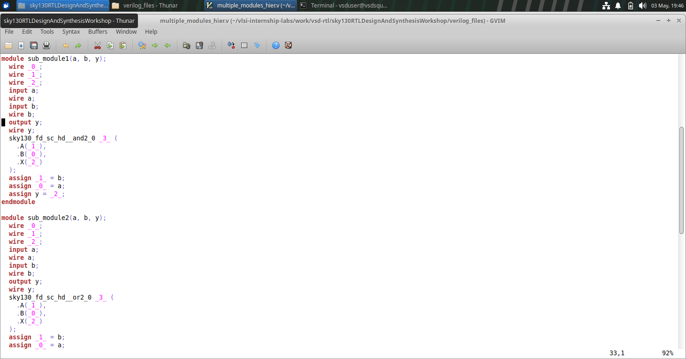
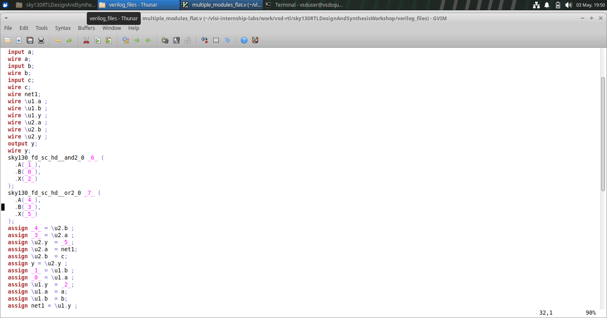
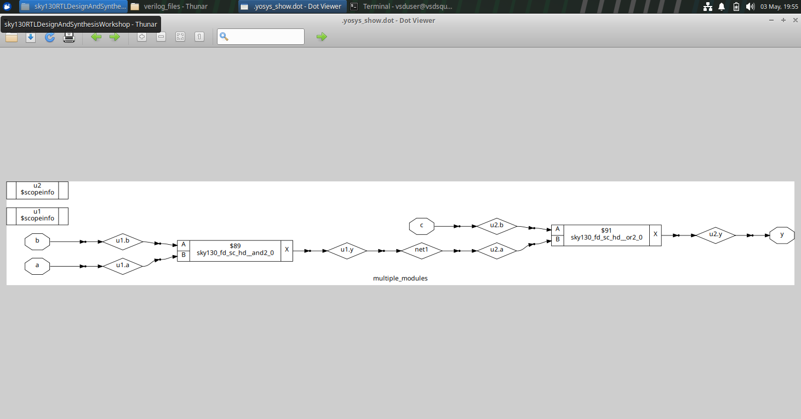
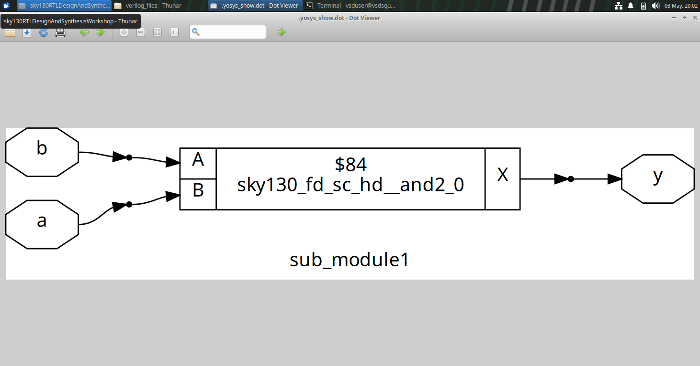

# Module 2 - Timing libs, hierarchical vs flat synthesis and efficient flop coding styles

## Subtopic 1: Introduction to timing .libs

---

We will open and take a look at the Sky130 library and try to understand it.
Command to open library (make sure you are in the same directory as the library):
```bash
gvim sky130_fd_sc_hd__tt_025C_1v80.lib
```



### PVT Variations and .lib File:

Digital circuits are affected by PVT variations:
* P (Process): Variations during fabrication (device size, doping, etc.) {indicated by tt - typical process}
* V (Voltage): Supply voltage fluctuations {indicated by 025C}
* T (Temperature): Operating temperature changes {indicated by 1v8}

It also gives information about various other things like technology, delay_model, units of voltage, current, resistance, etc.

Now here are different types of cells in the library:

And it also shows the various features of the cells, like the power information, the timing information, etc.

We can also see different flavours of the same type of cells consuming different areas and powers.

---

---


## Subtopic 2: Hierarchical vs Flat Synthesis

Open the multiple_modules files by using the command:
```bash
gvim multiple_modules.v
```


Now launch yosys and give all the commands given below:
```bash
read_liberty -lib ../lib/sky130_fd_sc_hd__tt_025C_1v80.lib
read_verilog multiple_modules.v
synth -top multiple_modules
abc -liberty ../lib/sky130_fd_sc_hd__tt_025C_1v80.lib
show multiple_modules
```
Here we can see the it only shows us the Hierarchical design.


Now open the netlist:
```bash
write_verilog -noattr multiple_modules_hier.v
!gvim multiple_modules_hier.v
```

This is the prime example of De-morgan's Theorem.

Now give the command to write a Flat netlist:
```bash
flatten
write_verilog -noattr multiple_modules_flat.v
!gvim multiple_modules_flat.v
```


Now exit yosys. and then re-enter it. then Give the following commands to view the flattened design:
```bash
read_liberty -lib ../lib/sky130_fd_sc_hd__tt_025C_1v80.lib
read_verilog multiple_modules.v
synth -top multiple_modules
abc -liberty ../lib/sky130_fd_sc_hd__tt_025C_1v80.lib
flatten
show
```


Now we will do the synthesis at sub-module level.
So again exit and re-enter yosys. Then give the following commands:
```bash
read_liberty -lib ../lib/sky130_fd_sc_hd__tt_025C_1v80.lib
read_verilog multiple_modules.v
synth -top sub_module1
abc -liberty ../lib/sky130_fd_sc_hd__tt_025C_1v80.lib
show
```

Module level systhesis is prefered when we have multiple instances of the same module OR we ant to do divide and conquer approach.

---

---


## Subtopic 3: Various Flop Coding Styles and Optimization

---

### Overview

This section focuses on understanding the importance of flip-flops in digital design, different coding styles, and how optimization techniques influence synthesis results and overall circuit performance.

---

### Topics Covered

Flip-flops play a crucial role in sequential circuits, and their behavior depends heavily on how they are described in Verilog. Different coding styles can lead to variations in synthesized hardware, affecting timing, area, and power.

This subtopic also explores how simulation and synthesis of flop-based designs are carried out, along with the role of optimization techniques in improving circuit efficiency.

---

### Lab Breakdown

In the first part, the fundamental need for flip-flops in digital systems is discussed along with an introduction to different coding styles used to implement them.

The second part continues this discussion by exploring various coding approaches in more depth and analyzing how these differences impact the synthesized hardware.

The third part involves practical lab work where flop-based designs are simulated and their waveform behavior is observed to verify correctness.

In the fourth part, additional simulations are performed to further validate the designs and compare outputs with expected results.

The fifth part introduces optimization techniques and explains how they affect parameters such as timing and area in digital circuits.

The final part extends these optimization concepts by examining more advanced techniques and understanding the trade-offs between performance, power, and area.

---

### Conclusion

This subtopic provided a clear understanding of flip-flop behavior, coding styles, and optimization techniques, demonstrating how design choices directly influence synthesis results and circuit efficiency.

